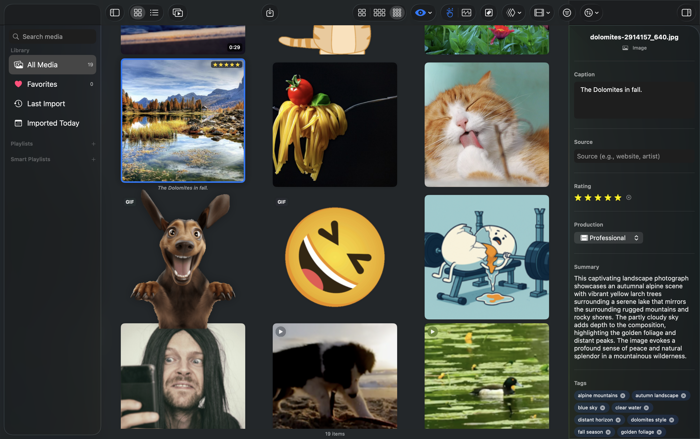
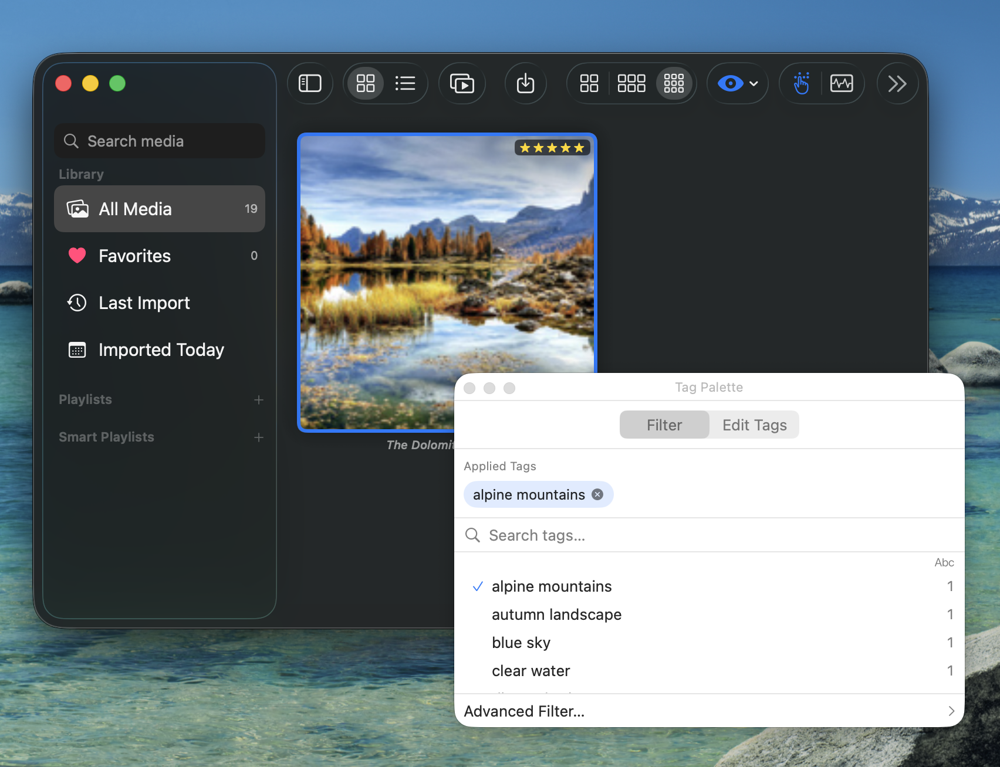
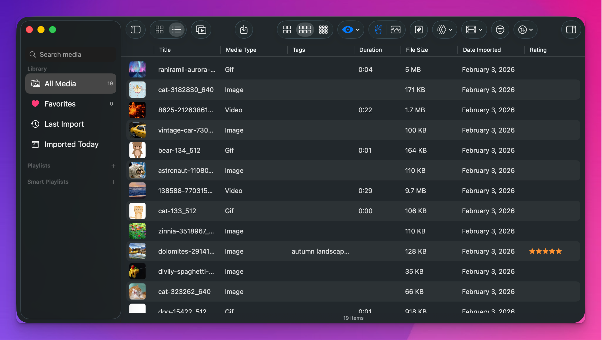
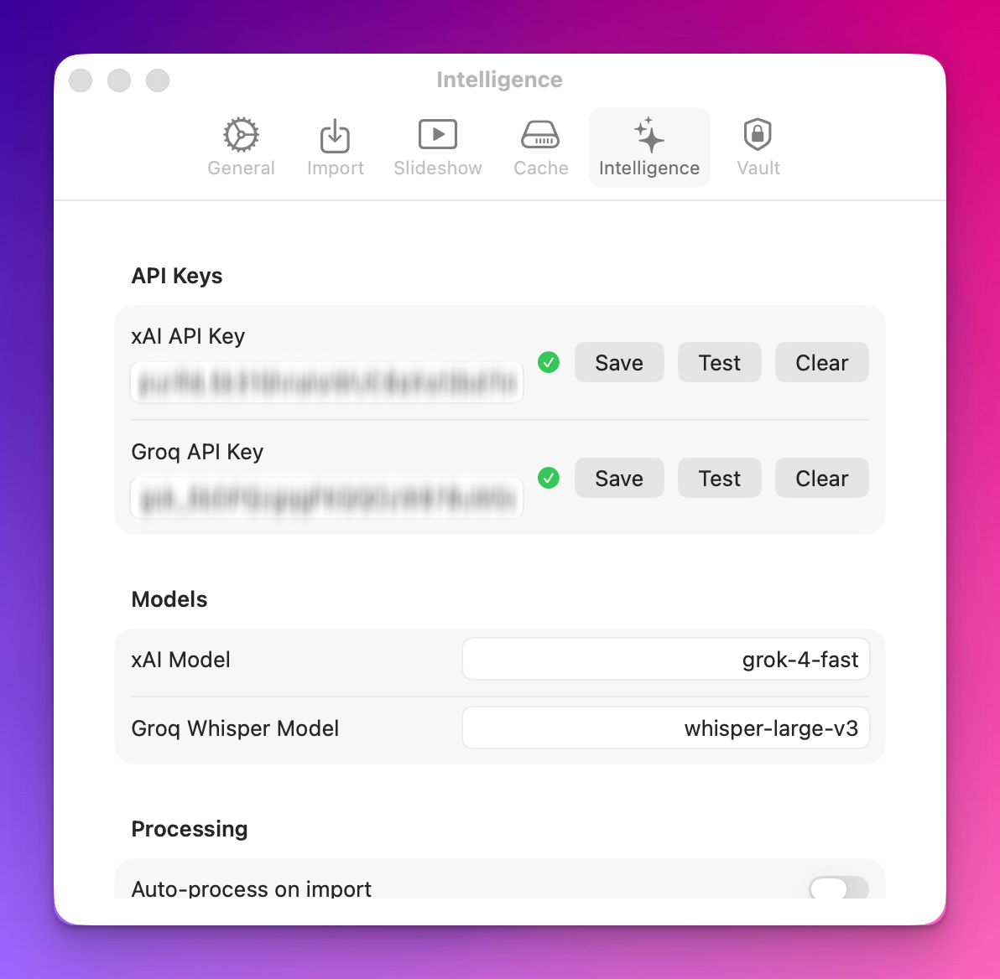
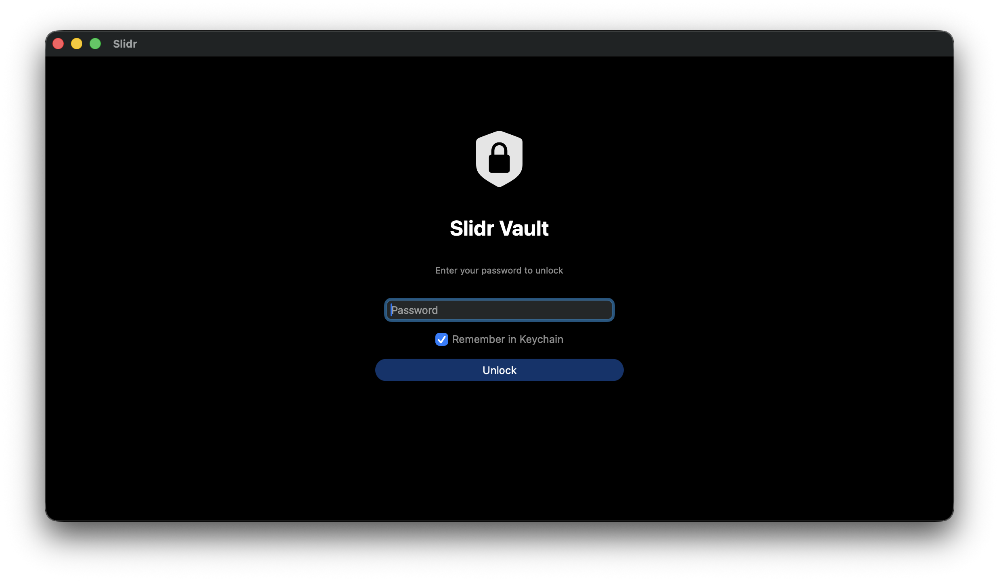

# Slidr

A native macOS media gallery viewer for images, GIFs, and videos.

<!-- Replace with your own screenshot -->


## Features

### Media Browsing

- **Grid view** with adjustable thumbnail sizes and animated GIF playback
- **List view** with sortable columns (name, date, size, duration, rating)
- **Video hover scrubbing** — preview videos by hovering over thumbnails
- **Quick Look** preview with Space bar
- Sort by name, date imported, date modified, file size, duration, or rating
- Advanced filtering by tags, media type, source, production type, duration, rating, and more

### Slideshow

- Fullscreen presentation with transition effects (crossfade, slide, zoom)
- Configurable timer per media type (images, GIFs, videos)
- **Multi-monitor support** with separate control panel window
- Shuffle and loop modes
- Captions with customizable position, font size, and opacity
- Subtitle overlay (SRT/VTT)
- Frame-accurate video scrubbing
- Rate items 1–5 stars during presentation

### Organization

- Manual playlists with drag-and-drop ordering
- **Smart playlists** with folder watching — auto-update when files change
- Tag palette for rapid batch tagging
- Star ratings and favorites
- Advanced filter rules with multiple criteria

### Media Inspector

- File metadata (dimensions, duration, format, size, codec)
- Editable captions, tags, source, and production classification
- Transcript viewer with timestamped seek-to-position links
- Contact sheet generation for videos

### AI Features (Optional)

All AI features require external API keys and are entirely optional.

- **Auto-tagging** via xAI (Grok) with vision analysis
- **Video tagging** via multi-frame contact sheet analysis
- **Summarization** of media content
- **Audio transcription** via Groq (Whisper)
- Batch processing for untagged or untranscribed media

### Vault Mode

- AES-256 encrypted sparse bundle storage
- Password protection with optional macOS Keychain integration
- Auto-lock on sleep, screensaver, or configurable timeout
- External drive vault support

### Import and Export

- Drag-and-drop import from Finder or other apps
- **Content-hash deduplication** — never import the same file twice
- Video format conversion (H.264 MP4)
- Organize imports by date
- Auto-create playlists from folder structure
- Export selected media
- External drive storage support

## Screenshots

<!-- Add your own screenshots to docs/screenshots/ -->

| View | Description |
|------|-------------|
|  | Main browsing interface with thumbnails and sidebar |
|  | Fullscreen presentation with captions |
|  | Media metadata and tag editing panel |
|  | Video preview on hover |
|  | Batch tagging interface |
|  | Column-based sortable list view |
|  | Playlist editor with filter rules |
|  | AI service configuration |
|  | Password entry screen |

## Requirements

- macOS 14.0 (Sonoma) or later
- Xcode 15+ (to build from source)
- Apple Silicon or Intel Mac

## Building from Source

```bash
git clone https://github.com/YOUR_USERNAME/Slidr.git
cd Slidr
open Slidr.xcodeproj
```

Build and run with **Cmd+R** in Xcode. Swift Package Manager dependencies resolve automatically on first build.

### Dependencies

| Package | Purpose |
|---------|---------|
| [SwiftOpenAI](https://github.com/jamesrochabrun/SwiftOpenAI) | OpenAI-compatible API client (used for xAI and Groq integration) |

## Configuration

### AI Services (Optional)

Slidr integrates with external AI APIs for auto-tagging, summarization, and transcription. These features are entirely optional — the app works fully without them.

- **xAI (Grok)** — image and video tagging, summarization. Get an API key from [x.ai](https://x.ai).
- **Groq (Whisper)** — audio transcription. Get an API key from [groq.com](https://groq.com).

Configure API keys in **Settings > Intelligence**. Keys are stored in the macOS Keychain.

### Vault Mode (Optional)

Enable encrypted media storage in **Settings > Vault**. The setup wizard walks through creating an AES-256 encrypted sparse bundle for your library.

### Storage Location

Media and data are stored in:

```
~/Library/Application Support/Slidr/
├── Library/Local/      # Imported media files
├── Library/External/   # External drive media (when mounted)
├── Thumbnails/         # Cached thumbnails
├── Transcripts/        # Audio transcriptions
└── Slidr.store         # SwiftData database
```

## Keyboard Shortcuts

### General

| Shortcut | Action |
|----------|--------|
| Cmd+, | Settings |
| Cmd+I | Import files |
| Cmd+Shift+I | Toggle inspector |
| Cmd+N | New playlist |
| Cmd+Shift+N | New smart playlist |
| Cmd+Shift+R | Reveal in Finder |
| Cmd+Shift+T | Toggle tag palette |
| Cmd+E | Export selected |
| Cmd+F | Focus search |
| Cmd+Option+F | Advanced filter |
| Cmd+1 | Grid view |
| Cmd+2 | List view |

### Grid

| Shortcut | Action |
|----------|--------|
| Cmd+A | Select all |
| Cmd+Shift+A | Deselect all |
| Delete | Delete selected |
| Space | Quick Look |
| Enter | Start slideshow |
| Arrow keys | Navigate selection |
| Cmd+/Cmd- | Adjust thumbnail size |
| Cmd+0 | Reset thumbnail size |
| Option+1–5 | Rate selected (stars) |
| Option+0 | Clear rating |

### Slideshow

| Shortcut | Action |
|----------|--------|
| Space | Play / Pause |
| Left / Right | Previous / Next |
| J / L | Previous / Next (alt) |
| Shift+Left / Right | Seek ±5 seconds |
| Option+Left / Right | Seek ±30 seconds |
| , / . | Frame step backward / forward |
| Up / Down | Volume up / down |
| M | Mute toggle |
| C | Toggle captions |
| I | Toggle info overlay |
| R | Toggle shuffle |
| F | Toggle fullscreen |
| 1–5 | Rate item (stars) |
| 0 | Clear rating |
| Escape | Exit slideshow |

### Intelligence

| Shortcut | Action |
|----------|--------|
| Cmd+Option+P | Process selected (full AI pipeline) |
| Cmd+Option+T | Tag selected |
| Cmd+Option+S | Summarize selected |
| Cmd+Option+W | Transcribe selected |

## Architecture

Slidr is built with **SwiftUI**, **SwiftData**, and **AVFoundation**.

```
Slidr/
├── App/                 # App entry point, AppDelegate, menu commands
├── Models/              # SwiftData @Model classes, enums, errors, schema versions
├── Services/            # Business logic (actors and @MainActor classes)
├── ViewModels/          # @Observable view state
├── Views/               # SwiftUI views organized by feature area
│   ├── Grid/            # Media grid and list browsing
│   ├── Slideshow/       # Fullscreen presentation
│   ├── Inspector/       # Media metadata editing
│   ├── Sidebar/         # Playlist navigation
│   ├── Playlist/        # Playlist editing
│   ├── Settings/        # Preferences
│   └── Shared/          # Reusable components
└── Utilities/           # Extensions and helpers
```

### Key Patterns

- **SwiftData** for persistence with versioned schema migrations
- **Actor isolation** for thread-safe services (`ThumbnailCache`, `VaultService`)
- **@MainActor** for UI-bound services (`MediaLibrary`, `PlaylistService`)
- **@Observable** for reactive view models (no Combine dependency for UI state)
- **Dependency injection** via SwiftUI `@Environment`
- **Content hashing** for import deduplication (first 1MB + last 1MB + file size)
- **FSEvents** via `DispatchSource` for smart playlist folder watching
- **AVAssetImageGenerator** for performant video hover scrubbing (no live playback in grid)

## Contributing

Contributions are welcome. Here are some guidelines:

1. Fork the repository and create a feature branch
2. Follow existing code conventions — SwiftUI, `@Observable`, actor isolation
3. Test on macOS 14.0+
4. Keep commits atomic with descriptive messages
5. Submit a pull request with a clear description

### Areas for Contribution

- **Tests** — unit and integration tests (none exist yet)
- **Accessibility** — VoiceOver support, keyboard navigation improvements
- **Localization** — multi-language support
- **Performance** — large library optimization
- **Documentation** — code-level documentation, tutorials

## License

MIT License — Copyright (c) 2025-2026 Christopher Culbreath

See [LICENSE](LICENSE) for details.

## Acknowledgments

- [SwiftOpenAI](https://github.com/jamesrochabrun/SwiftOpenAI) — OpenAI-compatible API client for Swift
